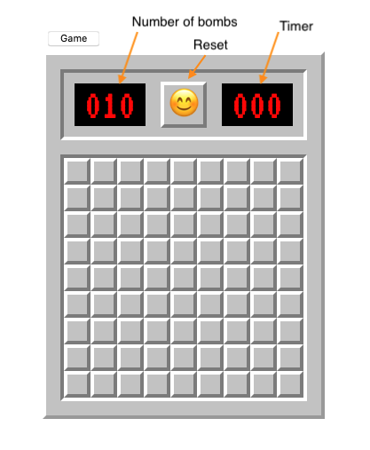
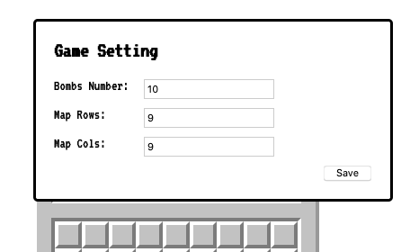
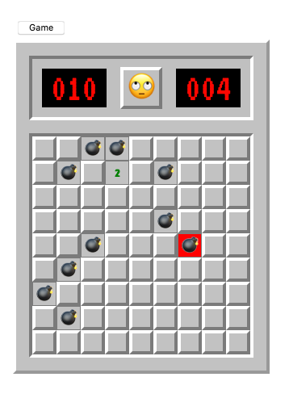

## Table of Content

1. [Description](#appinfo)
2. [Technologies](#technologies)
3. [Design](#design)

<a name="appinfo"></a>

## Description
The app is a traditional computer game. This is the first try for TypeScript. <br>
Demo: https://mine-sweeper-ts.netlify.app/

<a name="technologies"></a>

## Technologies
- React.js
- TypeScript

<a name="design"></a>

## Design
It uses `create-react-app` with the `ts` template to create the app.

```shell
npx create-react-app react-ts-minesweeper --template typescript
```
<br>

<br>
Setting <br>


End <br>

